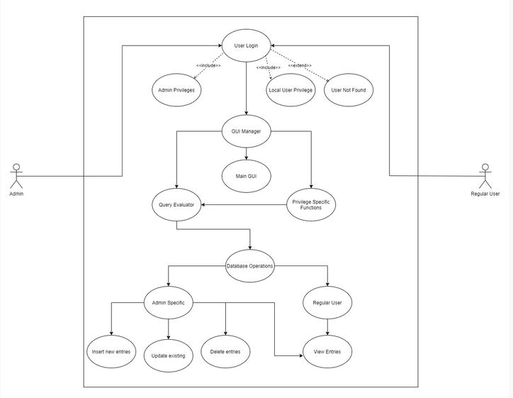
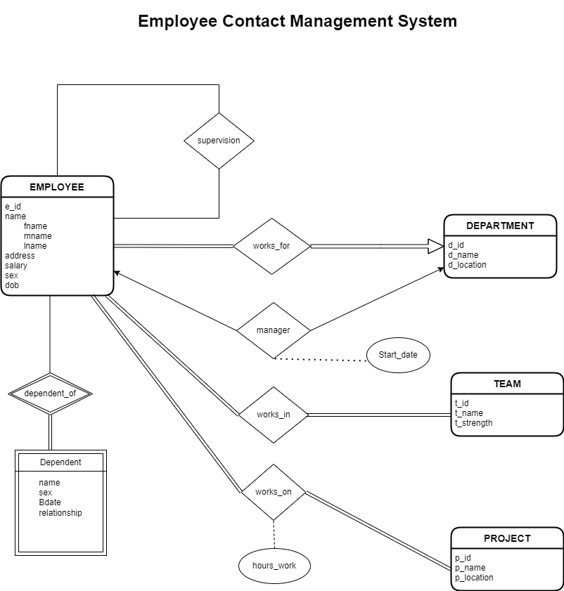
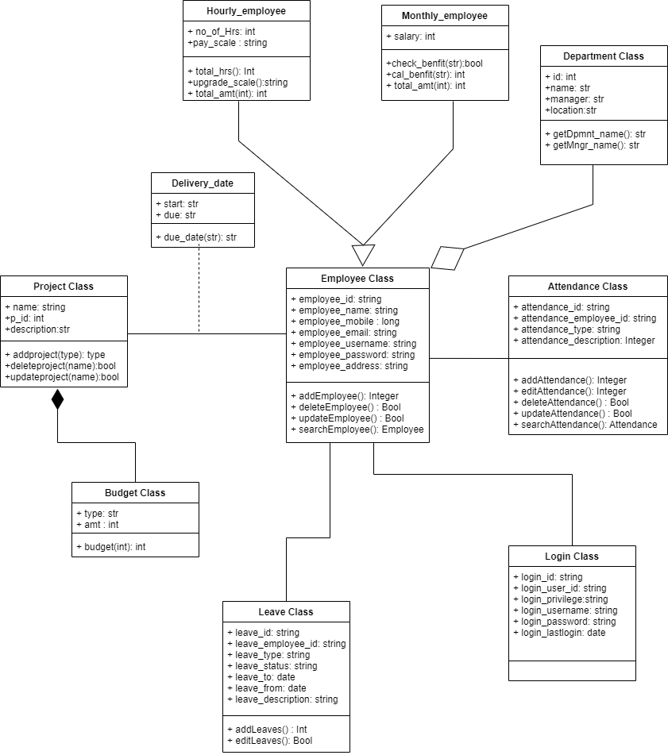

# ***Employee Contact Management System***
*A GUI Contact Mangement App for managing Employees created using Python*

## ***UML Relations***

- ***Use Case Diagram*** 

- ***Entity Relation Diagram***

- ***Class Diagram***

## ***User Stories***
- *Employee (Regular User) should be able to Insert, Update his details.*
- *Employee can View and Search contact details of other employees.*
- *Employer (Admin) can Create and Alter the database schema - add/delete attributes, tables etc.*
- *Employer can update all the employee details.*

## ***Contributors | Team Misfits***
- *Arathi Premkumar*
- *Jyothika Sony*
- *Meenakshi R*
- *Neeraj S Kumar*